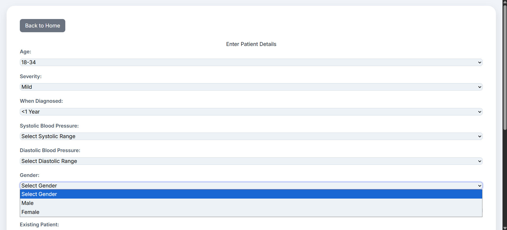
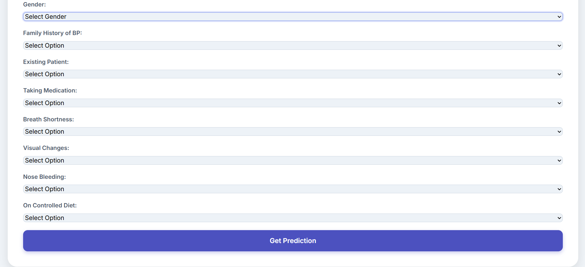

This document details the practical flow from raw data to model evaluation, as implemented in your four core Jupyter notebooks. This pipeline is designed for reproducible, modular, and transparent machine learning.

## 1. Data Preprocessing (`data_preprocessing.ipynb`)

**Goal:**
Convert raw, mixed-type tabular health data into a fully numerical, ML-ready format using robust preprocessing and encoders.

**Main steps:**

- **Import dependencies:**
Loads pandas and scikit-learn preprocessing utilities.
- **Load dataset:**
Reads raw data (categorical and numerical) from CSV.
- **Encode categorical columns:**
    - Uses `OrdinalEncoder` or `OneHotEncoder` for variables like Age, Gender, Severity, History, etc.
- **Pipeline construction:**
    - Uses `ColumnTransformer` to apply transformations only to appropriate columns.
    - Assembles a `Pipeline` object, making it easy to apply the same logic to new/unseen data.
- **Fit and transform:**
    - Produces a fully numerical DataFrame.
    - Saves the processor object (usually as a `.pkl` file) for later consistent usage.

*Key outputs:*

- `numerical_processed_patient_data.csv` for modeling
- Preprocessor object (`fitted_preprocessor.pkl`) for deployment or re-use


## 2. Exploratory Data Analysis (`eda.ipynb`)

**Goal:**
Gain insight into the processed data, assess distributions, spot issues, and prepare for feature selection or hypothesis testing.

**Main steps:**

- **Load processed data:**
Reads in the output from the preprocessing stage.
- **Examine structure:**
    - Prints data head and info.
    - Uses summary stats to check feature ranges and categories.
- **Data validation:**
    - Optionally reconstructs original categorical columns (inverse transform) for verification, visualization, or human QC.
- **Univariate and multivariate analysis:**
    - Uses matplotlib/seaborn for plotting distributions, correlations, and outliers.
    - Summarizes class balance, central tendency, and missing values.

*Key outputs:*

- Confirmation that all data is clean and appropriate for ML modeling
- Visualizations and summary statistics for documentation


## 3. Model Training (`model_training.ipynb`)

**Goal:**
Fit multiple ML models (classifiers) to the training set and serialize them for future independent evaluation.

**Main steps:**

- **Model selection:**
    - Defines and trains five classifiers (Logistic Regression, Random Forest, Decision Tree, Gaussian Naive Bayes, Multinomial Naive Bayes) on the same feature set.
- **Parameterization:**
    - Each model uses typical default or best-practice parameters, e.g., `RandomForestClassifier(n_estimators=100)`.
- **Fit on training data:**
    - Each model is trained independently (not in a loop, for clarity and debugging).
- **Model persistence:**
    - Uses `joblib.dump()` to save the trained model as a `.pkl` file in the `models/` directory.
    - Each file is named with the model type for clear retrieval.

*Key outputs:*

- `models/logistic_regression_model.pkl`
- `models/random_forest_model.pkl`
- `models/decision_tree_model.pkl`
- `models/gaussian_nb_model.pkl`
- `models/multinomial_nb_model.pkl`


## 4. Model Evaluation (`model_evaluation.ipynb`)

**Goal:**
Assess model performance consistently on the same test set split—facilitating side-by-side comparison.

**Main steps:**

- **Test data loading:**
    - Loads `X_test.csv` and `y_test.csv` files for evaluation.
- **Model loading:**
    - Loads each classifier individually from the `models/` directory using `joblib.load()`.
- **Prediction and metrics:**
    - For each model, predicts outcomes on `X_test`.
    - Computes and prints:
        - **Accuracy** (overall performance)
        - **Classification report** (precision, recall, F1 for each class)
        - **Confusion matrix** (detailed error analysis)
- **Output organization:**
    - Keeps code modular and results clear—one code cell for each model, with outputs grouped per classifier.
- **Result comparison:**
    - Performance numbers allow you to directly compare classifiers for selection or reporting.

*Key outputs:*

- Cell outputs: model-wise accuracy, classification report, and confusion matrix
- Potential to aggregate results into a performance summary table


## Example Directory Structure

```
project-root/
│
├── dataset/
│   ├── numerical_processed_patient_data.csv
│   ├── X_test.csv
│   └── y_test.csv
├── models/
│   ├── logistic_regression_model.pkl
│   ├── random_forest_model.pkl
│   ├── decision_tree_model.pkl
│   ├── gaussian_nb_model.pkl
│   └── multinomial_nb_model.pkl
├── notebooks/
|   ├── data_preprocessing.ipynb
|   ├── eda.ipynb
|   ├── model_training.ipynb
|   ├── model_evaluation.ipynb
├── requirements.txt
└── README.md
```
## Model Evaluation Results on Test Set

Test dataset size: 365 samples

### Logistic Regression

- **Accuracy:** 0.9726
- **Classification Report:**

| Class | Precision | Recall | F1-Score | Support |
| :-- | :-- | :-- | :-- | :-- |
| 0.0 | 1.00 | 1.00 | 1.00 | 67 |
| 1.0 | 1.00 | 1.00 | 1.00 | 130 |
| 2.0 | 1.00 | 0.92 | 0.96 | 120 |
| 3.0 | 0.83 | 1.00 | 0.91 | 48 |

- **Confusion Matrix:**

```
[[ 67  0   0   0 ]
 [  0 130  0   0 ]
 [  0  0  110 10 ]
 [  0  0   0  48 ]]
```


### Random Forest

- **Accuracy:** 1.0000
- **Classification Report:**

| Class | Precision | Recall | F1-Score | Support |
| :-- | :-- | :-- | :-- | :-- |
| 0.0 | 1.00 | 1.00 | 1.00 | 67 |
| 1.0 | 1.00 | 1.00 | 1.00 | 130 |
| 2.0 | 1.00 | 1.00 | 1.00 | 120 |
| 3.0 | 1.00 | 1.00 | 1.00 | 48 |

- **Confusion Matrix:**

```
[[ 67  0   0   0 ]
 [  0 130  0   0 ]
 [  0  0  120  0 ]
 [  0  0   0  48 ]]
```


### Decision Tree

- **Accuracy:** 1.0000
- **Classification Report:**

| Class | Precision | Recall | F1-Score | Support |
| :-- | :-- | :-- | :-- | :-- |
| 0.0 | 1.00 | 1.00 | 1.00 | 67 |
| 1.0 | 1.00 | 1.00 | 1.00 | 130 |
| 2.0 | 1.00 | 1.00 | 1.00 | 120 |
| 3.0 | 1.00 | 1.00 | 1.00 | 48 |

- **Confusion Matrix:**

```
[[ 67  0   0   0 ]
 [  0 130  0   0 ]
 [  0  0  120  0 ]
 [  0  0   0  48 ]]
```


### Gaussian Naive Bayes

- **Accuracy:** 0.8849
- **Classification Report:**

| Class | Precision | Recall | F1-Score | Support |
| :-- | :-- | :-- | :-- | :-- |
| 0.0 | 1.00 | 1.00 | 1.00 | 67 |
| 1.0 | 1.00 | 1.00 | 1.00 | 130 |
| 2.0 | 1.00 | 0.65 | 0.79 | 120 |
| 3.0 | 0.53 | 1.00 | 0.70 | 48 |

- **Confusion Matrix:**

```
[[ 67  0   0   0 ]
 [  0 130  0   0 ]
 [  0  0   78  42 ]
 [  0  0   0   48 ]]
```


### Multinomial Naive Bayes

- **Accuracy:** 0.9041
- **Classification Report:**

| Class | Precision | Recall | F1-Score | Support |
| :-- | :-- | :-- | :-- | :-- |
| 0.0 | 1.00 | 1.00 | 1.00 | 67 |
| 1.0 | 1.00 | 1.00 | 1.00 | 130 |
| 2.0 | 1.00 | 0.71 | 0.83 | 120 |
| 3.0 | 0.58 | 1.00 | 0.73 | 48 |

- **Confusion Matrix:**

```
[[ 67  0   0   0 ]
 [  0 130  0   0 ]
 [  0  0   85  35 ]
 [  0  0   0   48 ]]
```

## End-to-End Workflow Summary

1. **Preprocess data**
→ Convert raw tabular health records to numerical features and save.
2. **Perform EDA**
→ Inspect cleansed data for structure, balance, and quality.
3. **Train models**
→ Fit multiple classifiers; save each one for robust, modular evaluation.
4. **Evaluate models**
→ Reload and score each classifier on a reserved test set, using multiple metrics and confusion matrices.
5. **Compare \& select**
→ Choose the top-performing classifier for deployment or further study.

# Web Interface

This section provides a visual overview of the web interface for the Blood Pressure Analysis application.

### 1. Index Page (`index.html`)

This is the main landing page of the application, where users can initiate the process.


### 2. Details Page (`details.html`)

On this page, users input various patient details.

#### Input Section 1



#### Input Section 2



### 3. Prediction Results Page (`prediction.html`)

After submitting details, users are presented with the blood pressure analysis results.

